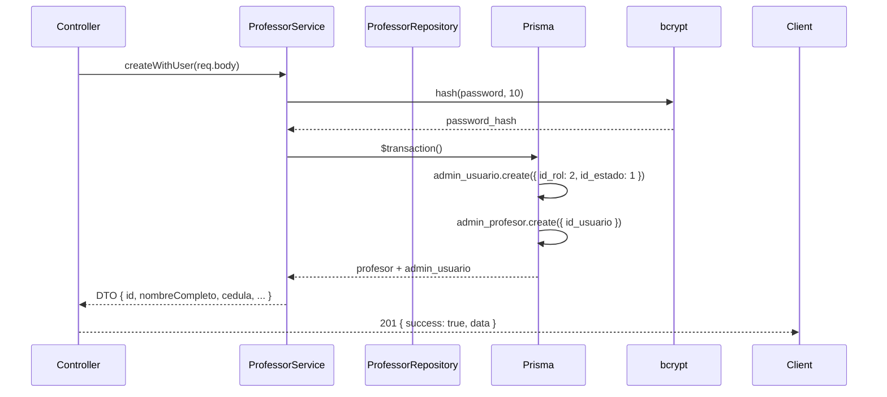
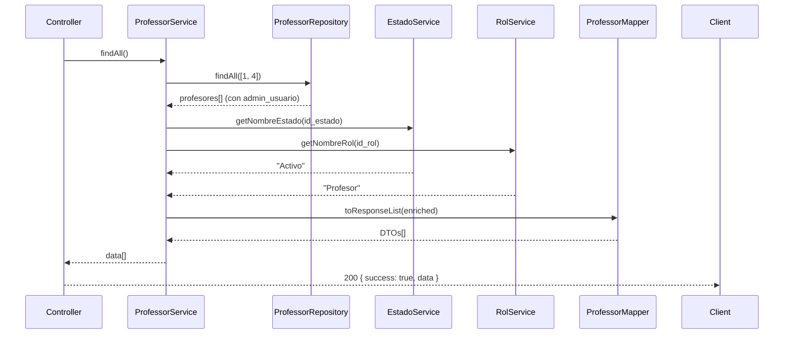
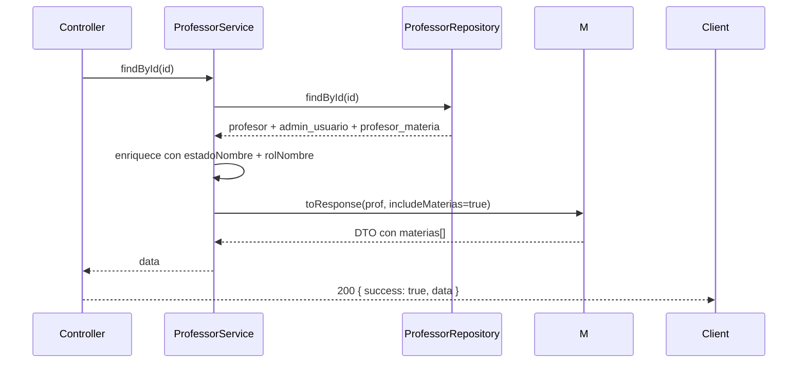
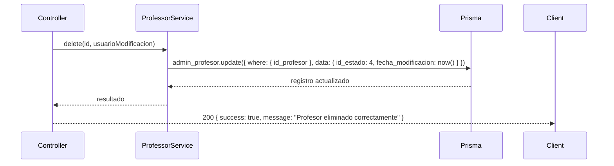

# 6. Flujos de Datos

## 6.1 Profesor — Crear (POST /api/v1/professors)



## 6.2 Profesor — Listar (GET /api/v1/professors)



## 6.3 Profesor — Obtener por ID (GET /api/v1/professors/:id)



## 6.4 Profesor — Actualizar (PUT /api/v1/professors/:id)

```
1. Route recibe PUT /professors/:id con body
2. Controller llama professorService.update(id, data, usuarioModificacion)
3. Service:
   a. Verifica que el profesor existe (professorRepository.findById)
   b. Si no existe → throw AppError('Profesor no encontrado', 404)
   c. Si hay campos de usuario (primer_nombre, apellido, cedula, correo):
      - Abre $transaction
      - Actualiza admin_usuario con los campos presentes
      - Actualiza admin_profesor (departamento, id_estado)
      - Retorna profesor actualizado
   d. Si solo hay campos de profesor:
      - ProfessorRepository.update(id, data) directo
4. Controller responde 200 con JSON
```

### PUT — Body esperado:
```json
{
  "primer_nombre": "Juan",
  "apellido_paterno": "Pérez",
  "apellido_materno": "López",
  "cedula": "0912345678",
  "correo": "juan@email.com",
  "departamento": "Física"
}
```

> **Nota**: `username` y `password` no se envían en edición.

## 6.5 Profesor — Soft Delete (DELETE /api/v1/professors/:id)



### Soft Delete — Detalle:
- **id_estado** cambia de `1` (Activo) a `4` (Eliminado)
- **fecha_modificacion** se actualiza a `new Date()`
- **usuario_modificacion** se toma de `req.user?.id_usuario` (o `null` si no hay auth)
- El registro NO se elimina físicamente de la BD
- Las consultas GET listan registros con `id_estado IN [1, 4]`
