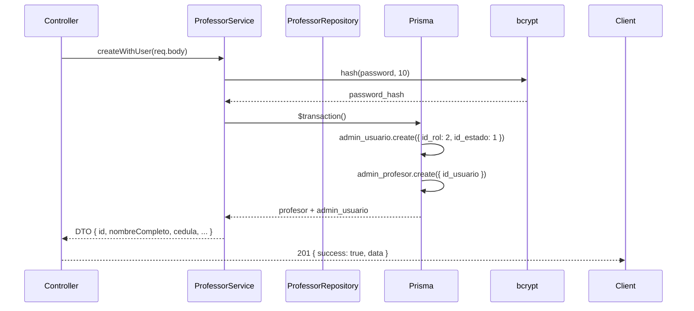
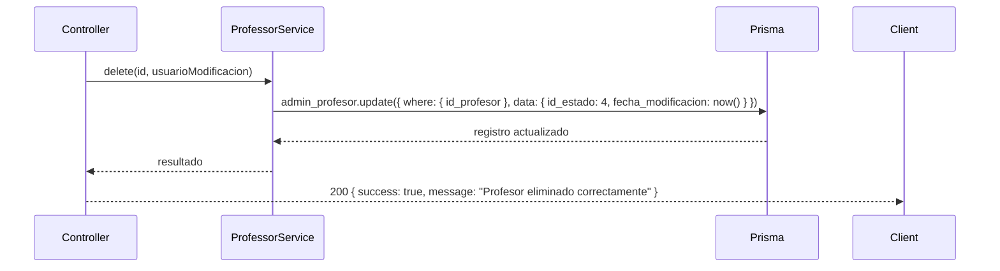
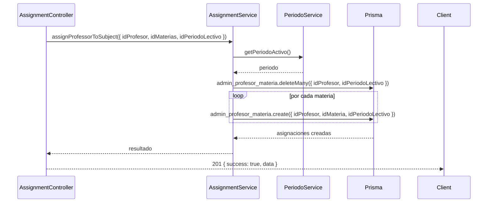
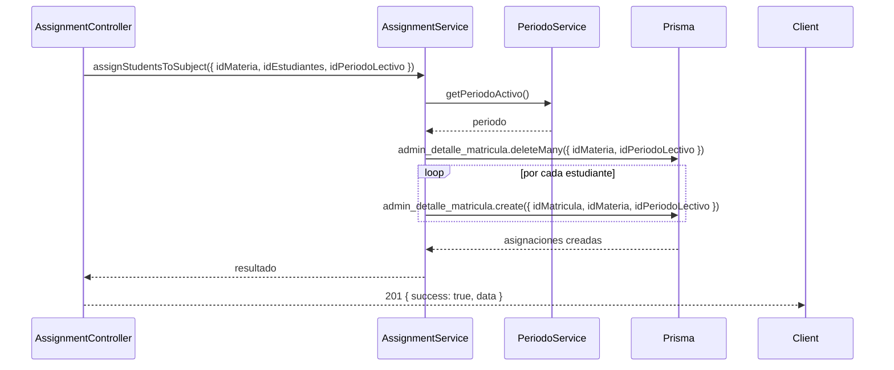

# 6. Flujos de Datos

## 6.1 Autenticación — Login

```
Cliente                  Gateway                    Backend
  │                        │                          │
  │  POST /api/auth/login  │                          │
  │  {username, password}  │                          │
  │───────────────────────>│                          │
  │                        │  POST /auth/login        │
  │                        │─────────────────────────>│
  │                        │                          │
  │                        │  Validar credenciales    │
  │                        │  Generar token JWT       │
  │                        │  Setear cookie HttpOnly  │
  │                        │<─────────────────────────│
  │  200 + Set-Cookie      │                          │
  │<───────────────────────│                          │
```

## 6.2 Autenticación — Verify

```
Cliente                    Gateway                    Backend
  │                          │                          │
  │  GET /api/auth/verify    │                          │
  │  (cookie automática)     │                          │
  │─────────────────────────>│                          │
  │                          │  GET /auth/verify        │
  │                          │  (con cookie)            │
  │                          │─────────────────────────>│
  │                          │                          │
  │                          │  Decodificar token       │
  │                          │  Retornar usuario + rol  │
  │                          │<─────────────────────────│
  │  200 {authenticated,     │                          │
  │  username, rol, ...}     │                          │
  │<─────────────────────────│                          │
```

## 6.3 Profesor — Crear (POST /api/admin/professors)



## 6.4 Profesor — Soft Delete (DELETE /api/admin/professors/:id)



## 6.5 Asignaciones — Profesor → Materia



## 6.6 Asignaciones — Estudiantes → Materia



> Ambos flujos de asignación reemplazan todas las asignaciones existentes del profesor/estudiante en el período (deleteMany + createMany).
