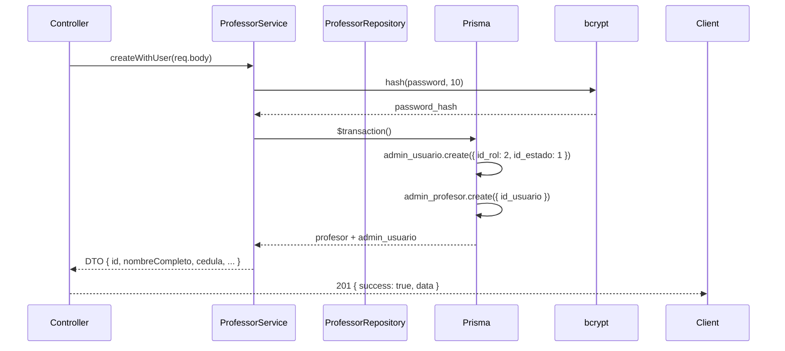
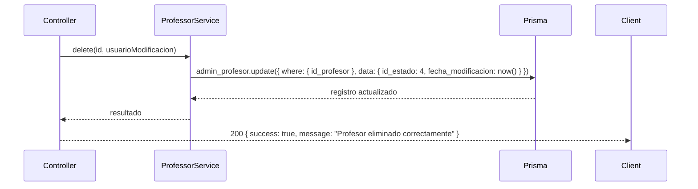
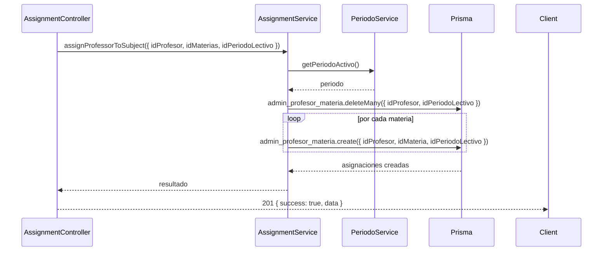
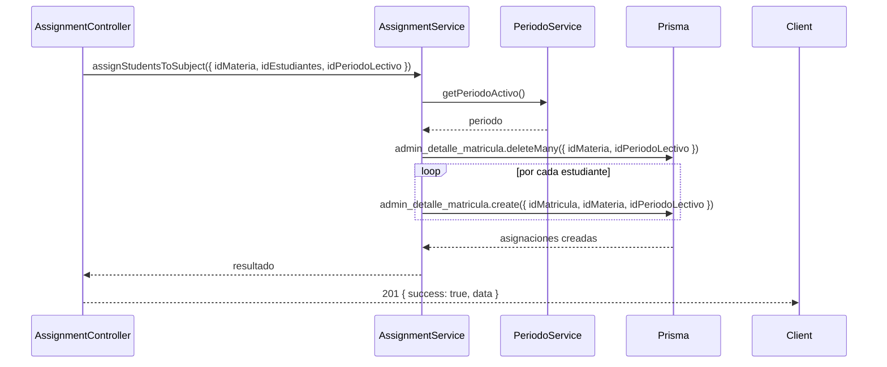

# 6. Flujos de Datos

## 6.1 Autenticación — Login

```
Cliente                  Gateway                    auth-ms
  │                        │                          │
  │  POST /api/auth/login  │                          │
  │  {username, password}  │                          │
  │───────────────────────>│                          │
  │                        │  POST /auth/login        │
  │                        │─────────────────────────>│
  │                        │                          │
  │                        │  Validar credenciales    │
  │                        │  Generar token JWT       │
  │                        │  Setear cookie HttpOnly  │
  │                        │<─────────────────────────│
  │  200 + Set-Cookie      │                          │
  │<───────────────────────│                          │
```

## 6.2 Autenticación — Verify y Role Check

```
Cliente                Gateway (8085)               Backend Admin (8002)
  │                      │                              │
  │  GET /auth/verify    │                              │
  │  (cookie automática) │                              │
  │─────────────────────>│                              │
  │                      │  Valida JWT (cookie/Bearer)  │
  │                      │  Extrae idUsuario, rol       │
  │                      │                              │
  │  200 {authenticated, │                              │
  │  username, rol}      │                              │
  │<─────────────────────│                              │
  │                      │                              │
  │  GET /api/admin/**   │                              │
  │  (cookie automática) │                              │
  │─────────────────────>│                              │
  │                      │  Valida JWT + RBAC           │
  │                      │  RoleRulesProperties.java    │
  │                      │  (solo ADMIN puede /api/admin)│
  │                      │                              │
  │                      │  Inyecta X-User-Id           │
  │                      │  Inyecta X-User-Role         │
  │                      │  Inyecta X-Username          │
  │                      │  Descarta JWT original       │
  │                      │                              │
  │                      │  GET /api/admin/**           │
  │                      │  (con X-User-* headers)      │
  │                      │─────────────────────────────>│
  │                      │                              │
  │                      │  1. auth.middleware.js       │
  │                      │     → Lee X-User-* headers   │
  │                      │     → Crea req.user          │
  │                      │                              │
  │                      │  2. role.middleware.js       │
  │                      │     → requireRole(ADMIN)     │
  │                      │     → 403 si no coincide     │
  │                      │                              │
  │                      │  3. Controller → Service    │
  │                      │     → usa req.user.id_usuario│
  │                      │                              │
  │                      │<─────────────────────────────│
  │  Response            │                              │
  │<─────────────────────│                              │
```

> El Gateway es el único que valida JWT. El backend confía en los `X-User-*` headers porque solo el Gateway puede inyectarlos (red interna).

## 6.3 Flujo — Role incorrecto (403)

```
Cliente              Gateway                   Backend Admin
  │                    │                           │
  │  GET /api/admin/** │                           │
  │───────────────────>│                           │
  │                    │  Valida JWT + RBAC        │
  │                    │  Rol no autorizado        │
  │                    │                           │
  │  403 Forbidden     │                           │
  │<───────────────────│                           │
```

Si el request pasa el Gateway (por. ej. un rol con acceso parcial), el backend también verifica:

```
Cliente              Gateway                   Backend Admin
  │                    │                           │
  │  GET /api/admin/** │                           │
  │───────────────────>│                           │
  │                    │  Inyecta X-User-* headers │
  │                    │──────────────────────────>│
  │                    │                           │
  │                    │  role.middleware.js       │
  │                    │  → 403 si rol ≠ ADMIN    │
  │                    │<──────────────────────────│
  │  403 Forbidden     │                           │
  │<───────────────────│                           │
```

## 6.3 Profesor — Crear (POST /api/admin/professors)



## 6.4 Profesor — Soft Delete (DELETE /api/admin/professors/:id)



## 6.5 Asignaciones — Profesor → Materia



## 6.6 Asignaciones — Estudiantes → Materia



> Ambos flujos de asignación reemplazan todas las asignaciones existentes del profesor/estudiante en el período (deleteMany + createMany).
